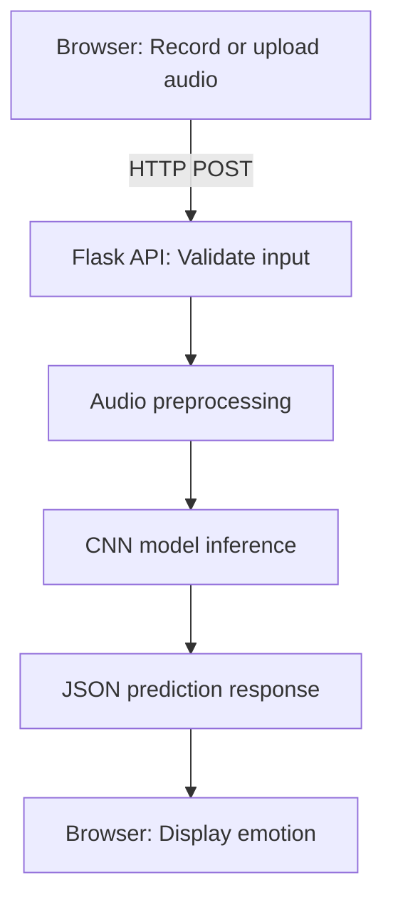

```mermaid
graph TD
    A[Browser: Record or upload audio] -->|HTTP POST| B[Flask API: Validate input]
    B --> C[Audio preprocessing]
    C --> D[CNN model inference]
    D --> E[JSON prediction response]
    E --> F[Browser: Display emotion]
```
